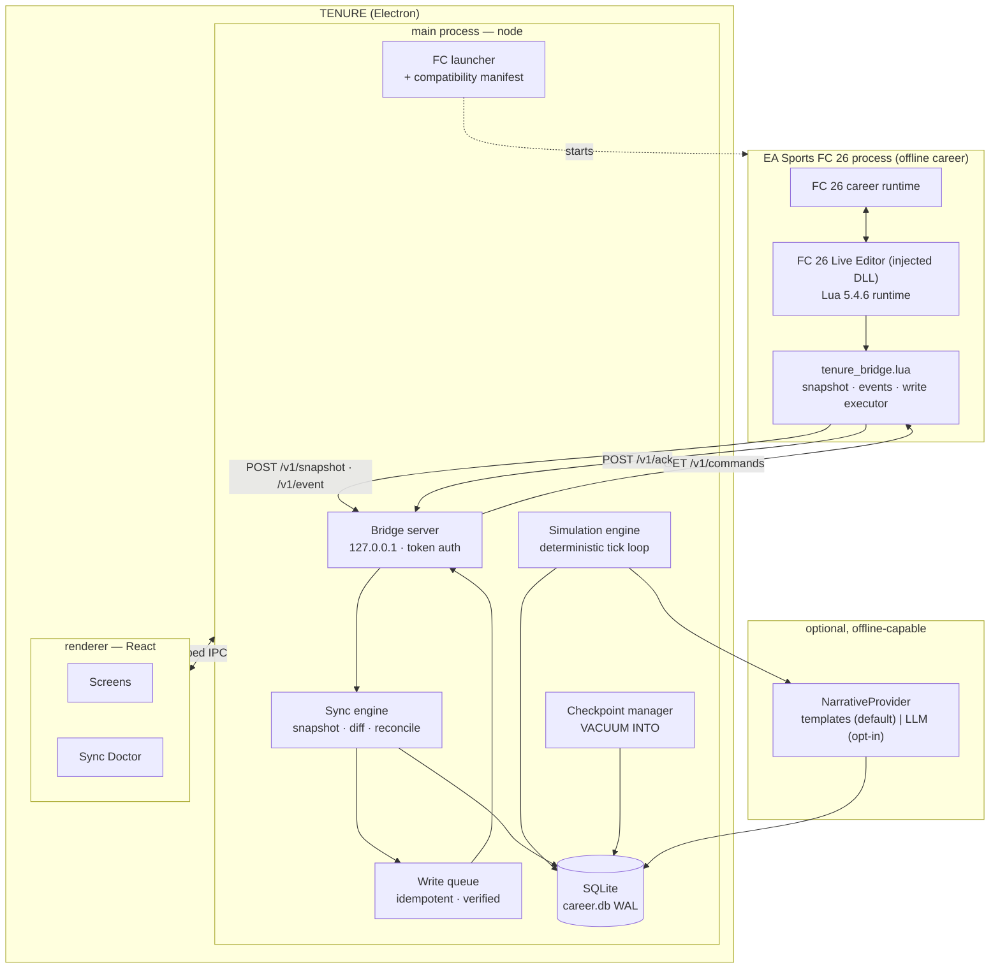

# 04 — Technology Stack, Architecture, Repository, Data Model

## 1. Stack comparison

Scored for *this* developer: medium conventional coding ability, very strong AI direction, 10–15 h/week, solo, Windows-only target.

| Criterion | Tauri 2 + React/TS + Rust | **Electron + React/TS** | .NET 8 + Avalonia |
|---|---|---|---|
| Claude Code output quality | Good for TS, weaker + slower iteration for Rust | **Best available** — largest corpus, most idiomatic output | Good C#, weaker XAML UI iteration |
| Languages the dev must debug | 2 (TS + Rust) | **1** | 1 (+ XAML) |
| Windows integration (process launch, registry, paths) | Good (via Rust) | **Good (node `child_process`, `fs`, `winreg`)** | Excellent |
| Local HTTP server for the bridge | Rust (axum) | **node `http` — trivial, same language as everything** | ASP.NET minimal API — excellent |
| SQLite | plugin / rusqlite | **`better-sqlite3` — synchronous, fast, ideal for a sim** | EF Core / Microsoft.Data.Sqlite — excellent |
| Headless testing of the simulation | Needs care | **Trivial: the sim is plain TS run under Vitest in Node** | Excellent under xUnit |
| Installer + auto-update | Excellent, small | Mature (`electron-builder` + `electron-updater`), **large** | Good (Velopack/MSIX) |
| Binary / RAM | ~10 MB, low RAM | **~150 MB, ~250–400 MB RAM** | ~60 MB, low RAM |
| UI iteration speed | Fast | **Fast** | Slower |
| Controller support | Gamepad API | **Gamepad API** | Manual |
| Maturity / answers to problems | Good | **Best** | Good |

### Decision: **Electron + TypeScript + React + better-sqlite3**

Reasoning, stated plainly: the binding constraint is not RAM, it is **developer-hours per shipped feature**. One language across UI, simulation, bridge server and tests removes an entire category of context-switching and of AI-assisted misfires. A 150 MB install and 300 MB of RAM is an acceptable price for a game that will sit next to a 100 GB football title.

The Tauri argument (small, fast, modern) is real but it buys resources this product does not lack, at the cost of the one resource it does: the developer's time and confidence in a second language.

**The hedge, which is mandatory:** `packages/domain`, `packages/sim`, `packages/sync` and `packages/persistence` must be **pure TypeScript with zero Electron and zero React imports**, enforced by lint rule. If Electron ever becomes the problem, the port to Tauri is a shell replacement, not a rewrite. This is the same rule that keeps simulation logic out of the UI, so it earns its keep twice.

### Supporting choices

| Concern | Choice | Why |
|---|---|---|
| Database | SQLite (`node:sqlite`), WAL mode — **superseded by [ADR 0001](adr/0001-sqlite-driver.md)**, originally `better-sqlite3` | Synchronous API suits a tick-based sim; single-file saves are trivially checkpointable via `VACUUM INTO`. Built-in means no native compilation and no `electron-rebuild`; the driver sits behind an adapter so the choice stays reversible |
| Migrations | Hand-rolled numbered SQL migrations + a `save_migrations` table | Boring, inspectable, reversible. No ORM magic between the dev and their save format |
| Query layer | Kysely (typed SQL builder) — **not** a full ORM | Types without hiding the SQL. The sim's batch passes must stay raw `UPDATE` |
| State (UI) | Zustand + TanStack Query over IPC | Small, obvious, no boilerplate |
| Simulation language | TypeScript | Same language; fully testable headless |
| RNG | In-repo splitmix64 + counter streams (~40 lines) | Determinism must be owned, not imported |
| Tests | Vitest (unit/integration), Playwright (a thin E2E smoke set) | Fast, TS-native |
| Logging | `pino` → rotating NDJSON in `%LOCALAPPDATA%\Tenure\logs` | Machine-readable; the diagnostic bundle is just a zip of these |
| Crash reporting | Local-only crash dumps + a user-initiated "export diagnostic bundle" | **No automatic telemetry.** Opt-in only, ever |
| Distribution | Portable ZIP **and** NSIS installer | Portable first: this audience already runs portable tools |
| Updates | `electron-updater`, explicit user consent, **backup before update** | Silent updates near save files are a trust violation |
| Asset cache | `%LOCALAPPDATA%\Tenure\assets` — user-imported only | Ships with zero copyrighted assets. See doc 07 |
| AI boundary | One interface, `NarrativeProvider`, with a deterministic template implementation as default | See doc 06 |

---

## 2. Architecture diagram



Read the diagram for what it does **not** contain: no path from the renderer to FC, no path from the narrative provider to game state, and only one component (`WQ`) permitted to originate a write.

---

## 3. Repository structure

```
tenure/
├─ apps/
│  └─ desktop/                  # Electron shell ONLY. No game rules live here.
│     ├─ src/main/              # main process: window, IPC surface, lifecycle
│     │  ├─ ipc/                # typed channel definitions (contract with renderer)
│     │  ├─ services/           # wiring: db handle, sync engine, launcher
│     │  └─ launcher/           # FC + Live Editor detection, process start
│     ├─ src/preload/           # contextBridge; the only place `node` meets the UI
│     └─ src/renderer/          # React app
│        ├─ screens/            # one folder per screen in doc 05
│        ├─ components/         # presentational only
│        ├─ hooks/
│        └─ theme/              # tokens, typography, density, colour-blind palettes
├─ packages/
│  ├─ domain/                   # PURE. Entities, value objects, invariants, zod schemas.
│  ├─ sim/                      # PURE. Tick loop, systems, RNG streams, effects.
│  │  ├─ engine/                # advanceTo, event queue, effect application
│  │  ├─ systems/               # board, transfers, contracts, development, finance…
│  │  ├─ rng/                   # splitmix64 + derived streams
│  │  └─ balance/               # tunable constants in ONE place, data not code
│  ├─ sync/                     # PURE except for the http server adapter
│  │  ├─ protocol/              # envelopes, versioning, zod validation
│  │  ├─ server/                # the loopback HTTP server
│  │  ├─ snapshot/              # parse, normalise, map external ids
│  │  ├─ diff/                  # match extraction by snapshot diffing
│  │  ├─ reconcile/             # divergence detection + repair proposals
│  │  └─ writes/                # instruction builders, idempotency, verification
│  ├─ persistence/              # SQLite access, migrations, checkpoints, backups
│  │  └─ migrations/            # 0001_init.sql, 0002_…  (append only, never edited)
│  ├─ narrative/                # templates + optional AI provider behind one interface
│  └─ football-data/            # STATIC, ORIGINAL reference data only (see doc 07)
├─ bridge/                      # the Lua that runs inside FC
│  ├─ tenure_bridge.lua         # entry point, event handlers, main loop
│  ├─ lib/                      # transport, json, chunking, safe table reads
│  ├─ readers/                  # db_tables.lua, stats.lua, fixtures_offsets.lua ← the fragile one, isolated
│  ├─ writers/                  # transfer.lua, budget.lua, morale.lua
│  └─ compat/                   # per-game-build offset tables + guards
├─ tools/
│  ├─ schema-dump/              # runs in-game, dumps every table + field to JSON
│  ├─ mock-fc/                  # a fake bridge that replays recorded snapshots
│  ├─ soak/                     # headless N-season runner
│  └─ balance-report/           # generates economy/market health reports from soaks
├─ tests/
│  ├─ fixtures/                 # recorded real snapshots (anonymised), mock careers
│  ├─ integration/
│  └─ soak/
├─ packaging/                   # electron-builder config, NSIS, portable zip
├─ docs/                        # these documents + ADRs + compatibility matrix
└─ .github/workflows/           # ci.yml, soak.yml (nightly)
```

### Layering rules (enforced, not aspirational)

1. `packages/domain`, `sim`, `persistence` must not import from `apps/desktop` or from React. **Enforced by `eslint-plugin-boundaries` and a CI check.**
2. The renderer may not import `packages/sim` or `persistence`. It talks over typed IPC only.
3. Game rules never live in a React component. If a component contains a number that affects an outcome, it is a bug.
4. All tunable constants live in `packages/sim/balance` as data. Balance changes must never require a code change.
5. `bridge/readers/fixtures_offsets.lua` is the **only** file allowed to contain memory offsets, and every function in it must be guarded by a game-build check.

---

## 4. Initial database schema

Conventions: every table has `id INTEGER PRIMARY KEY`, `career_id` where career-scoped, `created_at`/`updated_at` (integer epoch ms), and `row_version INTEGER NOT NULL DEFAULT 1`. Soft deletion only where history matters (`deleted_at`); append-only tables never delete.

```sql
-- ═══ identity, versioning, saves ═══
CREATE TABLE save_migrations (
  version INTEGER PRIMARY KEY, applied_at INTEGER NOT NULL, checksum TEXT NOT NULL);

CREATE TABLE careers (
  id INTEGER PRIMARY KEY,
  name TEXT NOT NULL,
  save_uid TEXT NOT NULL UNIQUE,          -- FC GetSaveUID(), our anchor
  master_seed TEXT NOT NULL,              -- determinism root
  current_date INTEGER NOT NULL,          -- days since epoch
  tick_index INTEGER NOT NULL DEFAULT 0,
  managed_club_id INTEGER REFERENCES clubs(id),
  schema_version INTEGER NOT NULL,
  game_build TEXT, le_version TEXT,
  sync_mode TEXT NOT NULL DEFAULT 'connected',   -- connected | offline | unsynced
  created_at INTEGER NOT NULL, updated_at INTEGER NOT NULL);

-- ═══ world ═══
CREATE TABLE seasons (
  id INTEGER PRIMARY KEY, career_id INTEGER NOT NULL REFERENCES careers(id),
  start_year INTEGER NOT NULL, end_year INTEGER NOT NULL, status TEXT NOT NULL,
  UNIQUE(career_id, start_year));

CREATE TABLE competitions (
  id INTEGER PRIMARY KEY, career_id INTEGER NOT NULL REFERENCES careers(id),
  name TEXT NOT NULL, kind TEXT NOT NULL,      -- league | cup | continental
  country TEXT, tier INTEGER, reputation INTEGER NOT NULL,
  fidelity TEXT NOT NULL DEFAULT 'shallow',    -- deep | medium | shallow
  UNIQUE(career_id, name));

CREATE TABLE clubs (
  id INTEGER PRIMARY KEY, career_id INTEGER NOT NULL REFERENCES careers(id),
  name TEXT NOT NULL, short_name TEXT,
  competition_id INTEGER REFERENCES competitions(id),
  reputation INTEGER NOT NULL, strength REAL NOT NULL,
  fidelity TEXT NOT NULL DEFAULT 'shallow',
  recruitment_philosophy TEXT, wage_structure_tier INTEGER,
  created_at INTEGER NOT NULL, updated_at INTEGER NOT NULL);
CREATE INDEX idx_clubs_career_comp ON clubs(career_id, competition_id);

CREATE TABLE players (
  id INTEGER PRIMARY KEY, career_id INTEGER NOT NULL REFERENCES careers(id),
  club_id INTEGER REFERENCES clubs(id),
  first_name TEXT, last_name TEXT, known_as TEXT,
  birth_date INTEGER NOT NULL, nationality TEXT,
  primary_position TEXT NOT NULL, secondary_positions TEXT,
  current_ability INTEGER, potential_low INTEGER, potential_high INTEGER,
  status TEXT NOT NULL DEFAULT 'active',       -- active | retired | released
  origin TEXT NOT NULL DEFAULT 'imported',     -- imported | generated | youth
  deleted_at INTEGER,
  created_at INTEGER NOT NULL, updated_at INTEGER NOT NULL);
CREATE INDEX idx_players_club ON players(career_id, club_id) WHERE deleted_at IS NULL;

-- narrow, hot table kept separate from the wide one
CREATE TABLE player_attributes (
  player_id INTEGER PRIMARY KEY REFERENCES players(id),
  fitness INTEGER NOT NULL, sharpness INTEGER NOT NULL,
  form INTEGER NOT NULL, morale INTEGER NOT NULL,
  match_load INTEGER NOT NULL DEFAULT 0, injury_risk REAL NOT NULL DEFAULT 0,
  updated_at INTEGER NOT NULL);

CREATE TABLE player_personalities (      -- five traits, not thirty-eight
  player_id INTEGER PRIMARY KEY REFERENCES players(id),
  professionalism INTEGER NOT NULL, ambition INTEGER NOT NULL,
  loyalty INTEGER NOT NULL, consistency INTEGER NOT NULL,
  pressure INTEGER NOT NULL,
  seed TEXT NOT NULL);                   -- derivation seed → regeneratable, auditable

CREATE TABLE staff (
  id INTEGER PRIMARY KEY, career_id INTEGER NOT NULL REFERENCES careers(id),
  club_id INTEGER REFERENCES clubs(id), name TEXT NOT NULL,
  role TEXT NOT NULL,                    -- coach | scout | physio | analyst
  judgement INTEGER, specialism TEXT, region TEXT, bias TEXT);

-- ═══ contracts & promises ═══
CREATE TABLE contracts (
  id INTEGER PRIMARY KEY, career_id INTEGER NOT NULL REFERENCES careers(id),
  player_id INTEGER NOT NULL REFERENCES players(id),
  club_id INTEGER NOT NULL REFERENCES clubs(id),
  kind TEXT NOT NULL,                    -- permanent | loan | youth
  wage INTEGER NOT NULL, wage_is_estimated INTEGER NOT NULL DEFAULT 0,
  start_date INTEGER NOT NULL, end_date INTEGER NOT NULL,
  squad_role TEXT, release_clause INTEGER,
  status TEXT NOT NULL,                  -- active | expired | terminated
  external_source TEXT);                 -- fc | companion
CREATE UNIQUE INDEX uq_contract_active_permanent
  ON contracts(player_id) WHERE status='active' AND kind='permanent';   -- ← invariant, in the schema

CREATE TABLE promises (                  -- APPEND ONLY
  id INTEGER PRIMARY KEY, career_id INTEGER NOT NULL REFERENCES careers(id),
  made_to_type TEXT NOT NULL, made_to_id INTEGER NOT NULL,
  kind TEXT NOT NULL,                    -- playing_time | sale | signing | european_football
  terms_json TEXT NOT NULL, made_on INTEGER NOT NULL, due_on INTEGER,
  state TEXT NOT NULL,                   -- open | kept | broken | expired | renegotiated
  resolved_on INTEGER, supersedes_id INTEGER REFERENCES promises(id),
  source_event_id INTEGER REFERENCES sim_events(id));
CREATE INDEX idx_promises_open ON promises(career_id, state, due_on);

-- ═══ board ═══
CREATE TABLE board_members (
  id INTEGER PRIMARY KEY, career_id INTEGER NOT NULL REFERENCES careers(id),
  club_id INTEGER NOT NULL REFERENCES clubs(id), name TEXT NOT NULL,
  role TEXT NOT NULL,                    -- chair | sporting_director | finance_director
  patience INTEGER NOT NULL, trust INTEGER NOT NULL,
  priorities_json TEXT NOT NULL, authority_json TEXT NOT NULL, voice TEXT NOT NULL);

CREATE TABLE board_objectives (
  id INTEGER PRIMARY KEY, career_id INTEGER NOT NULL REFERENCES careers(id),
  season_id INTEGER NOT NULL REFERENCES seasons(id),
  set_by INTEGER REFERENCES board_members(id),
  kind TEXT NOT NULL, target_json TEXT NOT NULL, weight REAL NOT NULL,
  negotiated INTEGER NOT NULL DEFAULT 0,
  status TEXT NOT NULL);                 -- open | met | failed | revised

-- ═══ calendar & matches ═══
CREATE TABLE fixtures (
  id INTEGER PRIMARY KEY, career_id INTEGER NOT NULL REFERENCES careers(id),
  season_id INTEGER NOT NULL REFERENCES seasons(id),
  competition_id INTEGER NOT NULL REFERENCES competitions(id),
  home_club_id INTEGER NOT NULL REFERENCES clubs(id),
  away_club_id INTEGER NOT NULL REFERENCES clubs(id),
  scheduled_date INTEGER NOT NULL, stage TEXT,
  status TEXT NOT NULL,                  -- scheduled | user_pending | played | simulated
  external_fixture_id INTEGER,
  UNIQUE(career_id, season_id, competition_id, home_club_id, away_club_id, scheduled_date));
CREATE INDEX idx_fixtures_date ON fixtures(career_id, scheduled_date);

CREATE TABLE match_results (             -- APPEND ONLY
  id INTEGER PRIMARY KEY, fixture_id INTEGER NOT NULL UNIQUE REFERENCES fixtures(id),
  home_goals INTEGER NOT NULL, away_goals INTEGER NOT NULL,
  home_pens INTEGER, away_pens INTEGER,
  provenance TEXT NOT NULL,              -- fc_sync | user_entered | simulated
  confirmed_by_user INTEGER NOT NULL DEFAULT 0,
  snapshot_before_id INTEGER REFERENCES sync_snapshots(id),
  snapshot_after_id  INTEGER REFERENCES sync_snapshots(id),
  created_at INTEGER NOT NULL);

CREATE TABLE player_match_stats (        -- APPEND ONLY; derived by diffing
  id INTEGER PRIMARY KEY, match_result_id INTEGER NOT NULL REFERENCES match_results(id),
  player_id INTEGER NOT NULL REFERENCES players(id),
  appearances INTEGER, goals INTEGER, assists INTEGER,
  yellow INTEGER, red INTEGER, clean_sheet INTEGER, rating REAL,
  derivation TEXT NOT NULL,              -- snapshot_diff | user_entered
  confidence REAL NOT NULL DEFAULT 1.0,
  UNIQUE(match_result_id, player_id));

-- ═══ market ═══
CREATE TABLE transfer_negotiations (
  id INTEGER PRIMARY KEY, career_id INTEGER NOT NULL REFERENCES careers(id),
  player_id INTEGER NOT NULL REFERENCES players(id),
  from_club_id INTEGER REFERENCES clubs(id), to_club_id INTEGER REFERENCES clubs(id),
  state TEXT NOT NULL, opened_on INTEGER NOT NULL, deadline INTEGER,
  history_json TEXT NOT NULL,            -- every turn, append-only within the row
  closed_on INTEGER, outcome TEXT);
CREATE INDEX idx_neg_open ON transfer_negotiations(career_id, state);

CREATE TABLE transfer_transactions (     -- APPEND ONLY
  id INTEGER PRIMARY KEY, career_id INTEGER NOT NULL REFERENCES careers(id),
  negotiation_id INTEGER REFERENCES transfer_negotiations(id),
  player_id INTEGER NOT NULL REFERENCES players(id),
  from_club_id INTEGER, to_club_id INTEGER,
  fee INTEGER NOT NULL, structure_json TEXT, kind TEXT NOT NULL,
  completed_on INTEGER NOT NULL,
  fc_state TEXT NOT NULL DEFAULT 'unknown',  -- unknown|pending|applied|durable|divergent
  sync_operation_id INTEGER REFERENCES sync_operations(id));

-- ═══ scouting, relationships, media ═══
CREATE TABLE scouting_assignments (
  id INTEGER PRIMARY KEY, career_id INTEGER NOT NULL, staff_id INTEGER NOT NULL REFERENCES staff(id),
  scope TEXT NOT NULL, target_json TEXT NOT NULL,
  started_on INTEGER NOT NULL, ends_on INTEGER, status TEXT NOT NULL);

CREATE TABLE scouting_reports (          -- APPEND ONLY
  id INTEGER PRIMARY KEY, assignment_id INTEGER REFERENCES scouting_assignments(id),
  player_id INTEGER NOT NULL REFERENCES players(id),
  ability_low INTEGER NOT NULL, ability_high INTEGER NOT NULL,
  potential_low INTEGER NOT NULL, potential_high INTEGER NOT NULL,
  confidence REAL NOT NULL, written_on INTEGER NOT NULL, notes_json TEXT);

CREATE TABLE relationships (
  id INTEGER PRIMARY KEY, career_id INTEGER NOT NULL,
  a_type TEXT NOT NULL, a_id INTEGER NOT NULL,
  b_type TEXT NOT NULL, b_id INTEGER NOT NULL,
  kind TEXT NOT NULL, value INTEGER NOT NULL,
  last_changed_on INTEGER NOT NULL, decay_rate REAL NOT NULL DEFAULT 0,
  UNIQUE(career_id, a_type, a_id, b_type, b_id, kind));

CREATE TABLE narrative_events (          -- APPEND ONLY
  id INTEGER PRIMARY KEY, career_id INTEGER NOT NULL,
  sim_event_id INTEGER NOT NULL REFERENCES sim_events(id),   -- NOT NULL: no story without a fact
  channel TEXT NOT NULL, author_id INTEGER, headline TEXT NOT NULL, body TEXT NOT NULL,
  generator TEXT NOT NULL,               -- template | llm
  template_id TEXT, occurred_on INTEGER NOT NULL);

CREATE TABLE messages (
  id INTEGER PRIMARY KEY, career_id INTEGER NOT NULL,
  kind TEXT NOT NULL, subject TEXT NOT NULL, body TEXT NOT NULL,
  requires_decision INTEGER NOT NULL DEFAULT 0, decision_json TEXT,
  sim_event_id INTEGER REFERENCES sim_events(id),
  received_on INTEGER NOT NULL, read_at INTEGER, resolved_at INTEGER);
CREATE INDEX idx_messages_unread ON messages(career_id, resolved_at, received_on);

-- ═══ money ═══
CREATE TABLE financial_transactions (    -- APPEND ONLY. Balance = SUM(amount).
  id INTEGER PRIMARY KEY, career_id INTEGER NOT NULL, club_id INTEGER NOT NULL REFERENCES clubs(id),
  amount INTEGER NOT NULL,               -- signed minor units
  category TEXT NOT NULL,                -- transfer_fee | wages | prize | sponsor | matchday | instalment
  occurred_on INTEGER NOT NULL, due_on INTEGER,
  counterparty_club_id INTEGER, source_event_id INTEGER REFERENCES sim_events(id),
  description TEXT NOT NULL);
CREATE INDEX idx_fin_club_date ON financial_transactions(club_id, occurred_on);

-- ═══ the spine: events & history ═══
CREATE TABLE sim_events (                -- APPEND ONLY. Determinism + explanation live here.
  id INTEGER PRIMARY KEY,
  career_id INTEGER NOT NULL, event_key TEXT NOT NULL,   -- deterministic dedupe key
  tick INTEGER NOT NULL, occurred_on INTEGER NOT NULL,
  kind TEXT NOT NULL, subject_type TEXT, subject_id INTEGER,
  cause_event_id INTEGER REFERENCES sim_events(id),      -- the causal chain
  payload_json TEXT NOT NULL, rng_stream TEXT, rng_draws_json TEXT,
  UNIQUE(career_id, event_key));
CREATE INDEX idx_events_subject ON sim_events(career_id, subject_type, subject_id, occurred_on);

CREATE TABLE historical_records (        -- APPEND ONLY; survives season rollover
  id INTEGER PRIMARY KEY, career_id INTEGER NOT NULL, season_id INTEGER NOT NULL,
  scope TEXT NOT NULL, subject_type TEXT NOT NULL, subject_id INTEGER NOT NULL,
  record_json TEXT NOT NULL);

-- ═══ sync ═══
CREATE TABLE sync_snapshots (
  id INTEGER PRIMARY KEY, career_id INTEGER NOT NULL,
  taken_at INTEGER NOT NULL, reason TEXT NOT NULL,       -- career_load|pre_match|post_match|window|rollover
  game_build TEXT, le_version TEXT, protocol INTEGER NOT NULL,
  in_game_date INTEGER, checksum TEXT NOT NULL,
  raw_path TEXT NOT NULL, entity_counts_json TEXT NOT NULL);

CREATE TABLE sync_operations (           -- APPEND ONLY
  id INTEGER PRIMARY KEY, career_id INTEGER NOT NULL,
  idempotency_key TEXT NOT NULL UNIQUE,
  kind TEXT NOT NULL, target_json TEXT NOT NULL, params_json TEXT NOT NULL,
  state TEXT NOT NULL,                   -- pending|sent|applied|durable|failed|abandoned
  attempts INTEGER NOT NULL DEFAULT 0, last_error TEXT,
  checkpoint_id INTEGER, created_at INTEGER NOT NULL, resolved_at INTEGER);

CREATE TABLE external_id_mappings (
  id INTEGER PRIMARY KEY, career_id INTEGER NOT NULL,
  entity_type TEXT NOT NULL, external_id INTEGER NOT NULL, internal_id INTEGER NOT NULL,
  confidence REAL NOT NULL DEFAULT 1.0, match_method TEXT NOT NULL,
  first_seen INTEGER NOT NULL, last_seen INTEGER NOT NULL,
  UNIQUE(career_id, entity_type, external_id));

CREATE TABLE sync_divergences (
  id INTEGER PRIMARY KEY, career_id INTEGER NOT NULL,
  entity_type TEXT NOT NULL, entity_id INTEGER NOT NULL, field TEXT NOT NULL,
  expected_json TEXT NOT NULL, observed_json TEXT NOT NULL,
  first_seen INTEGER NOT NULL, last_seen INTEGER NOT NULL,
  resolution TEXT, resolved_at INTEGER);
```

### Key relationships and policies

- `careers` is the tenant root; every career-scoped query filters `career_id` (a lint rule and a repository-layer guard enforce this — cross-career leakage is a whole class of bug worth designing out).
- `sim_events` is the causal spine: promises, narrative events, messages and financial transactions all reference the event that caused them. That single foreign key is what makes "why did this happen?" a query rather than a feature.
- **Append-only:** `sim_events`, `financial_transactions`, `match_results`, `player_match_stats`, `narrative_events`, `historical_records`, `promises`, `scouting_reports`, `transfer_transactions`, `sync_operations`.
- **Soft delete only** on `players` (retired/released footballers must stay queryable for history).
- **Two invariants live in the schema itself** (`uq_contract_active_permanent`, `sim_events.event_key` uniqueness) because an invariant the database enforces cannot be forgotten by application code.
