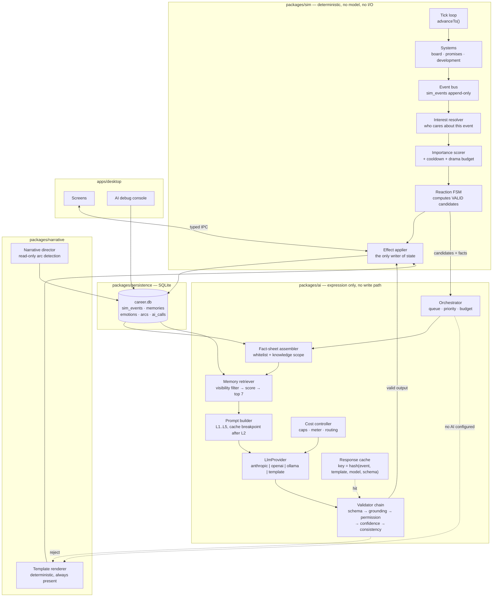

# 17 — AI Technical Architecture, Schema, Repository, and Observability

---

## 1. Architecture



Read the diagram for the two things it deliberately lacks: there is **no arrow from `AI` to `DB`**, and **no arrow from `AI` to `EFF` that bypasses `VAL`**.

## 2. Sequence diagrams

### 2.1 Player conversation (the vertical slice)

```mermaid
sequenceDiagram
    autonumber
    participant U as User
    participant UI as Renderer
    participant SIM as Simulation
    participant AI as AI orchestrator
    participant P as Provider
    participant DB as SQLite

    SIM->>DB: write sim_event (result imported)
    SIM->>SIM: interest → importance → gates
    Note over SIM: threshold passed; director reacts
    SIM->>SIM: FSM → candidates [concern, warning]
    SIM->>DB: apply effects, write reaction event + memory
    SIM->>AI: render(candidate=concern, characterRef, eventIds)
    AI->>DB: assemble fact sheet + retrieve ≤7 memories
    AI->>AI: build prompt L1..L5 (cache breakpoint after L2)
    AI->>P: messages.parse(schema=CharacterUtterance)
    P-->>AI: structured output
    AI->>AI: schema → grounding → permission → consistency
    alt valid
        AI->>DB: narrative_event (generator='llm') + ai_call log
    else invalid
        AI->>AI: regenerate once → still invalid → template
        AI->>DB: narrative_event (generator='template')
    end
    AI-->>UI: utterance + valid reply intents
    U->>UI: free text "you'll get your starts back after Christmas"
    UI->>AI: classify(text, validIntents)
    AI->>P: parse(schema=PressInterpretation)
    P-->>AI: {intent: promise_playing_time, strength: firm, condition: until_january, conf: 0.88}
    AI-->>UI: interpretation
    UI->>U: "You're promising regular starts until January. Send / Edit / Cancel"
    U->>UI: Send
    UI->>SIM: applyIntent(...)
    SIM->>DB: promise row + memory + sim_event
    Note over SIM,DB: The promise now exists. In week 20 it comes due.
```

### 2.2 Post-match reaction fan-out

```mermaid
sequenceDiagram
    autonumber
    participant SYNC as Sync engine
    participant SIM as Simulation
    participant AI as AI orchestrator
    participant Q as Background queue

    SYNC->>SIM: confirmed result + diffed player lines
    SIM->>SIM: write sim_events (result, apps, goals, cards)
    SIM->>SIM: candidates = events × interested characters   (≈40 pairs)
    loop deterministic order (importance, kind, id)
        SIM->>SIM: score, cooldown, drama budget, weekly cap
    end
    Note over SIM: 38 suppressed, 2 pass — this is the design working
    SIM->>AI: render × 2 (priority: interactive)
    SIM->>Q: enqueue media article (priority: background)
    AI-->>SIM: utterances (or templates)
    Note over Q: generated during idle; appears in Inbox when ready
```

### 2.3 Season review

```mermaid
sequenceDiagram
    autonumber
    participant SIM as Season rollover
    participant AGG as Digest builder
    participant AI as AI orchestrator
    participant P as Provider (Sonnet 5)
    participant V as Validator

    SIM->>AGG: season complete
    AGG->>AGG: aggregate results, promises, arcs, finances, development
    Note over AGG: every figure carries its query id or event id
    AGG->>AI: SeasonDigest (~15k tokens)
    AI->>P: messages.parse(schema=SeasonSummary)
    P-->>V: sections[] with per-claim `support`
    V->>V: EVERY claim must have support; verify each id/aggregate exists
    alt all claims supported
        V->>SIM: store summary + provenance
    else any unsupported
        V->>V: drop the offending claim; if > 20% dropped → template summary
    end
```

---

## 3. Database additions

Three future migrations on top of the current Phase 2 schema (`0004`).

```sql
-- 0005_characters_memory_emotion.sql
--   character_memories        (doc 12 §2.3)
--   memory_summaries          (doc 12 §2.3)
--   character_emotions        (doc 12 §3.1)
CREATE TABLE character_voices (
  career_id      INTEGER NOT NULL REFERENCES careers(id),
  character_type TEXT NOT NULL, character_id INTEGER NOT NULL,
  voice_tag      TEXT NOT NULL,
  authority_json TEXT NOT NULL,
  knowledge_json TEXT NOT NULL,
  seed           TEXT NOT NULL,
  PRIMARY KEY (career_id, character_type, character_id)
);

-- 0006_narrative_arcs.sql
--   narrative_arcs            (doc 14 §1.2)
CREATE TABLE reaction_cooldowns (
  career_id      INTEGER NOT NULL REFERENCES careers(id),
  character_type TEXT NOT NULL, character_id INTEGER NOT NULL,
  topic          TEXT NOT NULL,
  last_fired_on  INTEGER NOT NULL,
  times_fired    INTEGER NOT NULL DEFAULT 1,
  escalation_stage TEXT,
  PRIMARY KEY (career_id, character_type, character_id, topic)
);
CREATE TABLE drama_budget (
  career_id  INTEGER NOT NULL REFERENCES careers(id),
  season_id  INTEGER NOT NULL REFERENCES seasons(id),
  allowance  INTEGER NOT NULL,
  spent      INTEGER NOT NULL DEFAULT 0,
  open_conflicts INTEGER NOT NULL DEFAULT 0,
  PRIMARY KEY (career_id, season_id)
);

-- 0007_ai_observability.sql   APPEND ONLY. This is the replay + audit surface.
CREATE TABLE ai_calls (
  id                INTEGER PRIMARY KEY,
  career_id         INTEGER NOT NULL REFERENCES careers(id),
  trigger_event_id  INTEGER REFERENCES sim_events(id),
  purpose           TEXT    NOT NULL,   -- utterance | intent | media | scouting | summary
  character_type    TEXT, character_id INTEGER,
  provider          TEXT    NOT NULL,
  model             TEXT    NOT NULL,
  prompt_version    TEXT    NOT NULL,
  schema_version    INTEGER NOT NULL,
  fact_sheet_json   TEXT    NOT NULL,   -- exactly what the model was given
  memory_ids_json   TEXT    NOT NULL,
  candidates_json   TEXT,               -- the menu, when applicable
  raw_output        TEXT,
  validation_json   TEXT    NOT NULL,   -- per-gate pass/fail + reasons
  outcome           TEXT    NOT NULL    -- accepted | regenerated | template_fallback | cached | skipped
                    CHECK (outcome IN ('accepted','regenerated','template_fallback','cached','skipped')),
  input_tokens      INTEGER, output_tokens INTEGER,
  cache_read_tokens INTEGER, cache_write_tokens INTEGER,
  cost_micros       INTEGER,
  latency_ms        INTEGER,
  created_at        INTEGER NOT NULL
);
CREATE INDEX idx_ai_calls_event ON ai_calls (career_id, trigger_event_id);
CREATE INDEX idx_ai_calls_cost  ON ai_calls (career_id, created_at);

CREATE TABLE ai_response_cache (
  cache_key    TEXT PRIMARY KEY,        -- hash(sim_event_id, template_id, provider, model, schema_version)
  career_id    INTEGER NOT NULL REFERENCES careers(id),
  output_json  TEXT NOT NULL,
  created_at   INTEGER NOT NULL,
  hits         INTEGER NOT NULL DEFAULT 0
);

-- narrative_events gains a provenance column (0007)
ALTER TABLE narrative_events ADD COLUMN ai_call_id INTEGER REFERENCES ai_calls(id);
```

`ai_calls.fact_sheet_json` is what makes deterministic replay possible: an interaction can be re-run from stored inputs without touching the save (doc 17 §4).

---

## 4. Repository additions

```
packages/
├─ ai/                          NEW — expression only. No DB writes, ever.
│  ├─ orchestrator/             queue, priority, budget enforcement, cancellation
│  ├─ facts/                    fact-sheet assembler + knowledge-scope filters
│  ├─ memory/                   retrieval, scoring, visibility filter, compression
│  ├─ prompt/                   L1..L5 layer builders, versioned prompt registry
│  ├─ provider/                 LlmProvider + anthropic | openai | ollama | template
│  ├─ schema/                   the 12 JSON schemas + generated TS types
│  ├─ validate/                 schema → grounding → permission → confidence → consistency
│  ├─ cache/                    response cache keyed by event
│  └─ cost/                     estimation, routing, caps, meter
├─ sim/
│  ├─ characters/               NEW — interest resolver, reaction FSMs, escalation ladders
│  ├─ emotion/                  NEW — emotion model, decay, personality modifiers
│  └─ balance/ai.ts             NEW — thresholds, cooldowns, drama budget (data, not code)
├─ narrative/
│  ├─ templates/                NEW — the deterministic renderer + template data
│  ├─ voices/                   NEW — per-VoiceTag lexicons and banned phrase classes
│  └─ director/                 NEW — arc detectors (pure functions over sim_events)
tools/
├─ ai-replay/                   NEW — re-run a stored ai_call, diff the output
├─ ai-eval/                     NEW — offline evaluation harness (doc 18 §2)
└─ prompt-lint/                 NEW — cache-safety + injection-surface checks on prompts
tests/fixtures/
├─ utterances/                  NEW — labelled corpus for consistency scoring
└─ intents/                     NEW — 100+ labelled free-text → intent pairs
```

**New boundary rules, enforced by extending `tests/architecture.test.ts`:**

| Package | May not import |
|---|---|
| `packages/ai` | `packages/persistence` (it receives data, never queries) · `packages/sim/engine` |
| `packages/sim` | `packages/ai` (the simulation must run with the AI package absent) |
| `packages/narrative` | `packages/persistence` · any provider-specific identifier |
| anything outside `packages/ai/provider` | `@anthropic-ai/sdk`, `openai`, `ollama` |

That last rule is the vendor-independence guarantee, and it is checkable in one grep.

---

## 5. Core interfaces

```ts
// ── the contract between simulation and AI ────────────────────────────────
export interface FactSheet {
  readonly careerId: number;
  readonly asOf: number;                       // in-game date
  readonly subject: CharacterRef;
  readonly event: { id: number; kind: string; summary: Record<string, string | number> };
  readonly eventIds: readonly number[];        // the grounding whitelist
  readonly memories: readonly RetrievedMemory[];
  readonly emotion: EmotionBands;
  readonly traits: TraitBands;
  readonly club: ClubFacts;
  readonly knowledge: KnowledgeScope;
  readonly untrusted: Readonly<Record<string, string>>;   // names — delimited in the prompt
}

export interface ReactionCandidate {
  readonly id: string;                         // the menu is closed
  readonly kind: string;
  readonly effects: readonly Effect[];         // pre-computed by the simulation
  readonly preconditionsMet: true;
}

export interface RenderRequest<T> {
  readonly purpose: 'utterance' | 'intent' | 'media' | 'scouting' | 'summary';
  readonly facts: FactSheet;
  readonly candidates?: readonly ReactionCandidate[];
  readonly schema: JsonSchema<T>;
  readonly priority: 'interactive' | 'background';
  readonly promptVersion: string;
}

export interface RenderResult<T> {
  readonly output: T | null;                   // null ⇒ use the template
  readonly generator: 'template' | 'llm';
  readonly validation: ValidationReport;
  readonly usage?: TokenUsage;
  readonly aiCallId?: number;
}

export interface NarrativeProvider {                  // already declared in doc 07
  render<T>(req: RenderRequest<T>): Promise<RenderResult<T>>;
}
```

### The orchestrator loop

```
async function renderReaction(ctx, characterRef, candidates, triggerEvent):
    if not ctx.settings.aiEnabled:                  return template(...)
    if costController.overBudget():                 return template(..., reason: 'budget')

    key = hash(triggerEvent.id, candidates.map(c => c.id), provider, model, SCHEMA_VERSION)
    if cached = responseCache.get(key):             return cached          // same event, same words, forever

    facts    = factSheet.assemble(ctx, characterRef, triggerEvent)         // whitelist + knowledge scope
    memories = memory.retrieve(characterRef, triggerEvent, limit: 7)       // visibility-filtered
    prompt   = promptBuilder.build(L1..L5, facts, memories, candidates)    // stable layers first

    for attempt in 1..2:
        raw    = await provider.complete(prompt, schema)                   // structured output
        report = validate(raw, facts, candidates, characterRef)            // 5 gates
        if report.ok:
            responseCache.put(key, raw)
            aiCalls.record(...)                                            // full replay record
            return { output: raw, generator: 'llm', validation: report }
        prompt = promptBuilder.withViolation(prompt, report.firstFailure)  // one retry, named

    aiCalls.record(outcome: 'template_fallback', validation: report)
    return template(...)
```

---

## 6. AI debug console

A developer screen (and, redacted, a user-exportable bundle). For any `ai_call` it shows: the trigger event and its causal chain · the exact `FactSheet` · the retrieved memories with their scores · the character's deterministic state · the candidate menu · prompt version and rendered prompt with the cache breakpoint marked · provider, model, and whether the cache was read · raw output · per-gate validation results with reasons · the effects the simulation applied · tokens, cost, latency, cache status.

**Deterministic replay** — the property that makes the whole thing debuggable:

```bash
node tools/ai-replay/replay.mjs --call 4471 --model claude-haiku-4-5 --diff
```

Re-runs from the *stored* `fact_sheet_json`, so it never touches the save, never advances the simulation, and can be run against a different model or prompt version to compare. This is how prompt changes get evaluated against real history instead of against imagination.

**User diagnostic export:** the same records with entity names replaced by ids, no API key, no file paths, no save contents — a `ai-diagnostics-<date>.json` the user can inspect before sending.
