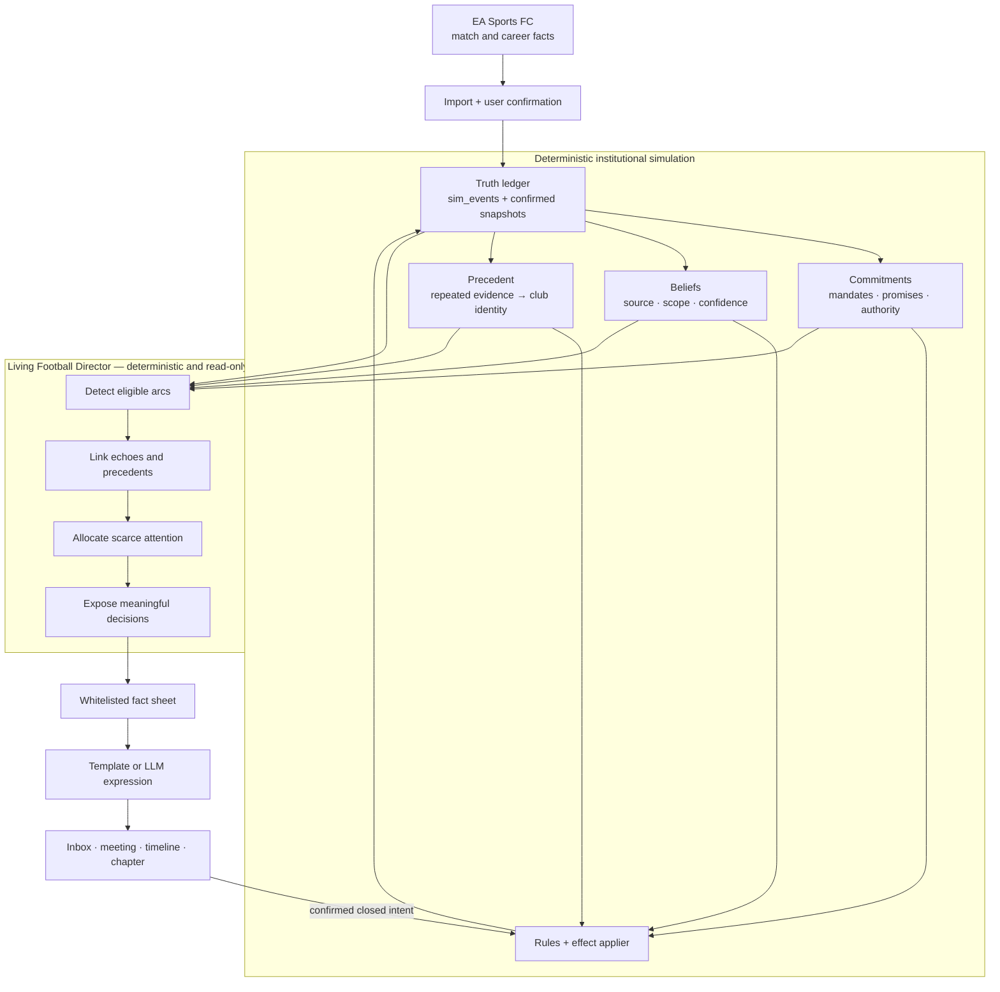

# 20 — The Living Football Director and the Broader TENURE Vision

> Evidence labels: **[C]** confirmed by a linked primary source · **[I]**
> inference from evidence · **[P]** proposed TENURE design.

---

## 1. Verdict: broaden the destination, not the first release

The broader product is worth building. TENURE should grow beyond a companion
that imports results and emits reactions into a **career ecology**: a football
club that behaves like an institution, people who hold different authority and
different versions of events, a manager whose methods become a portable
reputation, and a deterministic director that helps the player see the story
their decisions already created.

The product promise becomes:

> **Play the match in FC. Live the institution in TENURE. Every decision creates
> a fact, a constituency, a precedent, and a future version of your career.**

This is broader than “AI writes better articles.” It is also stricter than an
autonomous AI game master. The simulation decides what is true and what changes;
the **Living Football Director** curates attention, preserves context, and makes
the resulting choices and consequences legible. The language model expresses an
already valid reality. It never creates that reality.

The current Phase 0–3 critical path does not change. The bridge, import, board,
mandate, promises, and deterministic event loop are still the shortest route to
proving the thesis. Everything in this document is sequenced behind those gates.

---

## 2. Why this is the right expansion

FC 26 already advertises rotating Manager Live scenarios, manager movement,
unexpected off-pitch events, and a deeper simulation. Competing by adding a
larger pile of disconnected random events would put TENURE on EA's terrain.
TENURE's defensible space is **continuity and accountability**: an event matters
because the institution remembers who caused it, who knew, who benefited, what
was promised, and which later decision it changed. **[I]**
([EA FC 26 Career Mode deep dive][ea-career])

Interactive-narrative research gives three useful constraints:

1. Players report more agency when their available choices lead to meaningfully
   different future states, not merely different wording. **[C]**
   ([Cardona-Rivera et al., 2014][meaningful-choices])
2. An experience manager can preserve believable character behaviour while
   leaving every player action available; pruning player actions is not required
   to create structure. **[C]** ([Ware et al., 2019][graph-pruning])
3. In human-led interactive narrative, perceived structure and perceived agency
   were strongly linked. Structure is not automatically the enemy of freedom;
   opaque or coercive structure is. **[C]**
   ([Fisher, Siler, and Ware, 2025][improv-agency])

Recent LLM-agent research points in the same direction as TENURE's existing
doctrine. Plausible dialogue is not evidence of valid social behaviour;
interaction schedules, initial information, network structure, persona format,
and model choice can materially change collective outcomes. **[C]**
([Li and Tao, 2026][agents-insufficient], [Ye et al., 2026][trails])

Therefore the broader world must be a deterministic institutional simulation,
not a society of prompt-driven agents.

---

## 3. The four ledgers

TENURE already has an event log and promises. The broader design makes four
separate ledgers explicit so that “memory” never becomes an ambiguous text blob.

| Ledger | Canonical question | Examples | Writer |
|---|---|---|---|
| **Truth** | What actually happened? | result, selection, transfer, vote, quote, payment | deterministic simulation / confirmed FC import |
| **Commitment** | What is someone now obliged to do? | mandate, promise, contract term, delegated responsibility, public principle | deterministic rules after confirmed user or character action |
| **Belief** | Who knows or believes what, from which source, with what confidence? | private briefing, public fact, agent leak, rumour, disputed interpretation | deterministic information-propagation rules |
| **Precedent** | What pattern has this institution learned from repeated truth? | treats veterans well, sells academy graduates, protects managers, breaks wage structure | deterministic aggregation over evidence ids |

The ledgers are related but never collapsed:

- a rumour is not truth;
- a promise is not a result;
- one action is not yet a club principle;
- a character cannot remember or repeat a fact that never entered their belief
  scope;
- every belief and precedent retains its source event ids.

This structure borrows the useful lesson from long-horizon organisational-agent
research—hierarchies remain coherent when plans and artifacts are grounded in
dependency-aware trace memory—without adopting its runtime LLM agents. **[I]**
([Zhu et al., 2026][taskweave])

---

## 4. Architecture: the director sits above truth, never inside it



The Director may:

- detect and link arcs;
- decide which already-true situation deserves scarce presentation space;
- select an eligible viewpoint character using deterministic rules;
- choose the appropriate surface: background feed, inbox, meeting, or chapter;
- expose valid decisions and their known stakes;
- compress resolved history into a sourced career chapter.

The Director may not:

- alter match, financial, social, transfer, injury, or career outcomes;
- propose numeric effects for a validator to “tame” later;
- create a conflict because the week feels too quiet;
- hide a valid player action to steer toward a preferred ending;
- secretly tune difficulty, board patience, or event probability;
- give a character information outside their belief scope.

Director on/off is therefore a presentation experiment: the underlying world
state must remain byte-identical.

---

## 5. The systems worth adding

### 5.1 Club constitution and negotiated authority

A football club is not just relationships; it is decision rights. Model a
versioned **club constitution** containing:

- who appoints and removes each role;
- who recommends, approves, vetoes, executes, and is merely informed for each
  decision family;
- temporary delegations and emergency powers;
- ownership constraints and mandate terms;
- formal authority versus informal influence.

The manager's job offer becomes a negotiation over control, not only salary and
objectives. One club may grant transfer veto but demand youth minutes. Another
may give a sporting director final recruitment authority. The same manager
decision can therefore be valid at one club and insubordinate at another.

**Player value:** delegation becomes a strategic choice. Giving an academy
director control saves attention but makes their philosophy consequential.

**Hard invariant:** no actor may execute an action outside a currently valid
authority grant, and every override records both the formal rule and the actor
who broke or changed it.

### 5.2 Manager operating philosophy that is earned, not selected

The manager has a portable **evidence-backed identity**:

- youth trust;
- spending discipline;
- loyalty to players and staff;
- promise reliability;
- tactical continuity (only from declared plans and reachable FC facts);
- media posture;
- willingness to challenge authority;
- crisis performance;
- treatment of veterans and injured players.

The user may state principles at the start—“promote youth,” “never discuss
contracts publicly”—but reputation is computed from behaviour. A principle
creates a commitment other actors can cite; it does not award a trait. Clubs,
agents, staff, and players see different evidence and therefore may hold
different views of the same manager.

This creates the missing long game: interviews, job approaches, staff loyalty,
agent tactics, and board mandates are shaped by a record the user authored over
years rather than by an XP tree.

### 5.3 Information provenance, leaks, and contested reality

Do not simulate rumours by asking an LLM what spreads. Use a deterministic
information graph:

```ts
interface Belief {
  holderId: EntityId;
  propositionId: string;       // references structured truth or claim
  sourceId: EntityId | null;
  sourceEventId: SimEventId;
  grade: 'known' | 'reported' | 'rumoured' | 'disputed' | 'false_claim';
  confidence: number;          // deterministic, 0..100
  acquiredOn: GameDate;
}
```

Relationships, role access, confidentiality, incentives, and communication
events decide propagation. The model may phrase a leaked claim but cannot decide
who heard it or whether they believe it. Network structure and information
asymmetry materially affect diffusion in agent simulations, which is precisely
why those variables belong in explicit rules rather than prompts. **[I]**
([Zhang et al., 2025][asymmetric-diffusion])

### 5.4 Commitments, political capital, and opportunity cost

Promises should not be the only obligations. Add:

- favours owed and called in;
- public principles that make future reversals costly;
- coalition support for a specific decision;
- limited political capital with each constituency;
- attention commitments created by delegation or intervention;
- precedent costs: “we made an exception for him, so why not me?”

Political capital is not a universal mana bar. It is relationship-specific,
evidence-backed, and non-transferable. The finance director backing a transfer
does not buy goodwill with the captain.

### 5.5 Resonance: the past becomes mechanically relevant again

Every significant event receives deterministic motif tags such as
`promise`, `second_chance`, `loyalty`, `authority`, `academy`, `public_reversal`,
or `former_club`. When a new event shares actors, commitments, or motifs, the
Director can **reincorporate** the prior event as an echo:

- first broken promise → grievance;
- second broken promise → reputation evidence and agent distrust;
- returning to a former club → prior exit terms become interview context;
- asking for loyalty after abandoning staff → a visible contradiction;
- protecting an injured player → years-later loyalty evidence.

Reincorporation can make earlier player actions more structurally necessary,
but research found that stronger internal story unity did not automatically
increase players' reported agency or story quality. TENURE must therefore test
whether users actually notice and value the callback, not count links and assume
success. **[C]** ([Tomaszewski, 2011][reincorporation])

### 5.6 The decision lens: “why now, who knows, what changes?”

Every consequential screen exposes four layers without revealing hidden exact
values:

1. **Why now?** The evidence chain that made this decision surface.
2. **Who knows?** Which actors hold which grade of information.
3. **What is at stake?** The constituencies, commitments, and authority involved.
4. **What meaningfully differs?** The categories of state each available action
   can change—relationship, authority, money, promise, public position—not a
   guaranteed outcome preview.

This is not a “best choice” hint. It gives the player enough narrative affordance
to imagine distinct futures. The exact hidden reactions remain part of play.

### 5.7 Career chapters and scenario capsules

At natural boundaries—window close, cup exit, promotion, sacking, season end—the
Director compiles a **career chapter** from sourced events:

- the situation entering the chapter;
- the manager's decisive actions;
- commitments created or broken;
- turning points and linked precedents;
- unresolved threads;
- outcome and institutional consequences;
- provenance for every claim.

The same structured chapter can power:

- a concise “previously in this career” return screen;
- an end-of-season retrospective;
- a shareable, privacy-scrubbed after-action report;
- later, a deterministic **scenario capsule** another player can attempt from a
  synthetic or licensed-safe starting state—never raw copyrighted career data.

FC 26 already offers authored and live challenges. TENURE's distinct version is
not “play this week's real-world scenario”; it is “this crisis emerged from my
own record, and the game can prove how.” **[I]**

Retelling-based evaluation is valuable here because the story a player chooses
to tell reveals which systems and events were actually salient, not merely which
ones fired. **[C]** ([Kreminski et al., 2019][retellings])

---

## 6. The player-agency contract

The Living Football Director follows six enforceable rules:

1. **Never prune a valid player action for story quality.** If an action is
   impossible, the simulation must name the rule that makes it impossible.
2. **Every displayed choice changes meaningfully different state.** Two buttons
   that map to the same consequences with different tone are one button.
3. **Never protect an arc from the player's decision.** The user may end a feud,
   sell its central player, resign, or refuse the meeting. The arc adapts or ends.
4. **Quiet is valid.** The Director has no target emotional curve and cannot
   manufacture pressure to fill a content quota.
5. **Consequences may surprise; causes may not be unknowable.** Hidden traits can
   affect magnitude, but the causal category and evidence chain must be visible.
6. **The player authors principles as well as responses.** The system must let
   the manager initiate a philosophy, delegation, promise, public stance, or
   coalition—not only answer crises generated by the game.

The sixth rule is the important expansion. TENURE becomes more than a reactive
inbox when the user can make a claim about the kind of manager they intend to be
and then live with the institution's memory of that claim.

---

## 7. Story lifecycle, without a forced plot

Use the proposed seven-stage vocabulary as observation states, not a required
funnel:

1. **Seed** — eligible tension exists in facts.
2. **Signal** — a holder notices and the situation earns attention.
3. **Escalation** — new truth raises stakes.
4. **Decision** — at least two meaningfully different valid actions exist.
5. **Consequence** — deterministic effects apply.
6. **Echo** — the event changes a later interpretation or decision.
7. **Resolution** — truth closes, transforms, or abandons the arc.

An arc may disappear after Seed, resolve at Signal, skip Decision because no user
action is valid, remain dormant for years, or reopen as an Echo. The Director
does not push it through a screenplay shape.

---

## 8. What the language model is for

### Runtime, allowed

- render a simulation-decided utterance in a character's voice;
- parse free text into a closed, currently valid intent set;
- compress a supplied set of sourced events into prose;
- select emphasis among facts already approved for the speaker;
- create optional alternate wording that changes no state.

### Runtime, forbidden

- propose effect variables or numeric deltas;
- decide which event, arc, actor, or stage occurs;
- decide what a character knows, believes, or remembers;
- plan a character's strategy outside a deterministic candidate menu;
- create injuries, transfers, scandals, tactics, or facts;
- optimize a target mood by changing the simulated world.

### Development time, useful

The model may assist designers by drafting event-family graphs, templates,
adversarial fixtures, and voice variants. Work such as NarrativeGenie suggests
LLMs can help authors turn a high-level story outline into a partially ordered
event graph. TENURE can use that as an **authoring accelerator**, but every graph
is reviewed, converted to deterministic rules, and tested before shipping; the
runtime model never authors canon. **[I]**
([Kumaran, Rowe, and Lester, 2024][narrativegenie])

---

## 9. Scope and sequence

| When | Broader work admitted | Still excluded |
|---|---|---|
| **Phase 0–2** | none beyond interfaces and documentation | all runtime AI and institutional expansion |
| **Phase 3** | board authority scope; mandate; promises; template reactions; basic manager evidence | belief diffusion, media network, shareable chapters |
| **Phase 4–5** | club constitution; delegation; manager operating philosophy; precedent; resonance; decision lens | world-scale social agents |
| **Phase 6–7** | belief/provenance graph; staff politics; leaks; supporter constituencies; career chapters; retelling playtests | generated outcomes or autonomous agents |
| **Post-alpha** | privacy-safe scenario capsules; deeper manager/staff market; institutional evolution across clubs | anything that requires invented match telemetry |

The sequencing rule is strict: a broader feature enters implementation only when
its canonical data, decision it changes, explanation surface, determinism test,
and ten-season cost are all named.

---

## 10. Evaluation: prove that it creates careers worth remembering

Existing schema, grounding, cost, and latency gates remain. Add:

### Deterministic system gates

- **Director non-interference:** same seed and actions with Director on/off →
  byte-identical canonical state.
- **Agency separation:** every surfaced decision has at least two options whose
  effect categories or follow-up eligibility differ.
- **Authority validity:** no action executes without an authority path or a
  recorded override event.
- **Belief provenance:** every non-public belief has a source and reachable
  propagation path.
- **Precedent sufficiency:** no club principle forms from one event unless it is
  an explicit founding policy.
- **Causal completeness:** every consequence screen can answer “why now?” from
  event ids without invoking generated prose.

### Human experience gates

- After a multi-session playtest, ask the player to retell the career without
  showing the timeline. Code which decisions, people, commitments, and callbacks
  they mention.
- A successful slice is not “20 arcs fired.” It is that players accurately retell
  at least one causal chain containing an earlier decision and a later echo.
- Measure whether players understood what categories each decision could change,
  whether outcomes felt earned, and whether they felt free to reject the implied
  story.

### Robustness audit

Adopt a three-level audit inspired by TRAILS:

| Level | Perturb | Must remain stable |
|---|---|---|
| **Micro** | model/provider, prompt format, memory wording | facts, intent set, knowledge scope, canonical state |
| **Meso** | event ordering ties, network topology fixtures, presentation cadence | authority, propagation rules, arc eligibility, consequence signs |
| **Macro** | career seed, world fidelity tier, Director on/off | invariants, outcome distribution bounds, no hidden difficulty adjustment |

The prose may vary. The society may vary by seed. The causal rules and canonical
outcome for a fixed replay may not vary with a model prompt.

---

## 11. Decision table

| Idea | Decision | Reason |
|---|---|---|
| Deterministic Living Football Director | **Adopt** | curates a deep simulation without controlling it |
| Club constitution + negotiated decision rights | **Adopt after Board MVP** | distinctive, companion-authoritative, creates real politics |
| Evidence-backed manager identity | **Adopt** | makes “the job, not the club” mechanically real |
| Belief/provenance graph | **Adopt later** | enables honest leaks, rumours, and asymmetric information |
| Resonance and precedent | **Adopt** | converts memory into changed future decisions |
| Decision lens and causal preview | **Adopt** | strengthens agency without revealing hidden outcomes |
| Career chapters and retelling evaluation | **Adopt** | measures and surfaces the actual emotional promise |
| Privacy-safe scenario capsules | **Explore post-alpha** | differentiating, but export/privacy/rights work is substantial |
| LLM-assisted event authoring | **Adopt as a dev tool** | reduces authoring load without affecting runtime truth |
| AI-proposed bounded mechanical effects | **Reject** | still lets model/provider changes alter the simulation |
| Persistent autonomous character agents | **Reject** | cost, drift, scheduling sensitivity, loss of replayability |
| Emotional-trajectory optimization | **Reject** | manufactured drama and hidden manipulation |
| Tactical or match stories without telemetry | **Reject** | invented evidence violates the product's trust promise |

---

## 12. Sources

- [EA Sports, “FC 26 Career Mode Deep Dive,” 2025][ea-career].
- [Riedl and Bulitko, “Interactive Narrative,” AAAI 2012][interactive-narrative].
- [Ware et al., “Multi-Agent Narrative Experience Management as Story Graph Pruning,” AIIDE 2019][graph-pruning].
- [Cardona-Rivera et al., “Foreseeing Meaningful Choices,” AIIDE 2014][meaningful-choices].
- [Fisher, Siler, and Ware, “Structure, Agency, and Improvisation in Human-Led Digital Interactive Narrative Exercises,” AIIDE 2025][improv-agency].
- [Tomaszewski, “On the Use of Reincorporation in Interactive Drama,” AIIDE 2011][reincorporation].
- [Kreminski et al., “Evaluating AI-Based Games through Retellings,” AIIDE 2019][retellings].
- [Park et al., “Generative Agents,” UIST 2023][generative-agents].
- [Li and Tao, “AI Agents Alone Are Not (Yet) Sufficient for Social Simulation,” 2026 preprint][agents-insufficient].
- [Ye et al., “Stop Drawing Scientific Claims from LLM Social Simulations Without Robustness Audits,” 2026 preprint][trails].
- [Zhu et al., “Can LLM Agents Sustain Long-Horizon Organizational Dynamics?” 2026 preprint][taskweave].
- [Zhang et al., “Understanding Dynamic Diffusion Process of LLM-based Agents under Information Asymmetry,” 2025 preprint][asymmetric-diffusion].
- [Kumaran, Rowe, and Lester, “NarrativeGenie,” AIIDE 2024][narrativegenie].

[ea-career]: https://www.ea.com/en/games/ea-sports-fc/fc-26/news/pitch-notes-fc26-career-mode-deep-dive
[interactive-narrative]: https://doi.org/10.1609/aaai.v26i1.8447
[graph-pruning]: https://doi.org/10.1609/aiide.v15i1.5229
[meaningful-choices]: https://doi.org/10.1609/aiide.v10i1.12716
[improv-agency]: https://doi.org/10.1609/aiide.v21i1.36827
[reincorporation]: https://doi.org/10.1609/aiide.v7i2.12468
[retellings]: https://doi.org/10.1609/aiide.v15i1.5223
[generative-agents]: https://arxiv.org/abs/2304.03442
[agents-insufficient]: https://arxiv.org/abs/2603.00113
[trails]: https://arxiv.org/abs/2605.18890
[taskweave]: https://arxiv.org/abs/2606.01199
[asymmetric-diffusion]: https://arxiv.org/abs/2502.13160
[narrativegenie]: https://doi.org/10.1609/aiide.v20i1.31868
